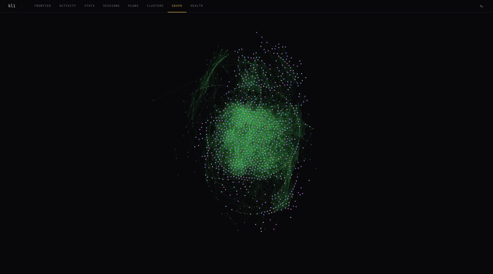

# kli

[](LICENSE)
<!-- [](https://github.com/kleisli-io/kli/actions) -->

Event-sourced task orchestration for [Claude Code](https://docs.anthropic.com/en/docs/claude-code). kli adds a typed task graph, multi-agent coordination via CRDTs, and structured development workflows. An MCP server and hooks work in the background alongside vanilla Claude Code and Agent teams. Or drive it directly: `/kli:research` -> `/kli:plan` -> `/kli:implement` -> `/kli:reflect`.



- [Quick Start](#quick-start)
- [What kli Does](#what-kli-does)
- [Landscape](#landscape)
- [Installation](#installation)
- [Architecture](#architecture)
- [What kli Is Not](#what-kli-is-not)

## Quick Start

```bash
curl -fsSL https://kli.kleisli.io/install | sh
```

Then, in any project:

```bash
kli init
```

This configures the MCP server, hooks, skills, agents, and commands. Claude Code queries the task graph through TQ, a composable pipeline language:

```clojure
;; "Show me the most active tasks"
(-> (active) :enrich (:sort :obs-count) (:take 3) (:select :display-name :obs-count))

  kli-landing-page-prototype    47 observations
  fix-tq-core-bugs              23 observations
  add-spread-activation         12 observations
```

Full documentation at [docs.kleisli.io/kli](https://docs.kleisli.io/kli).

## What kli Does

A single binary. The MCP server and hooks handle task tracking and agent coordination in the background; skills provide structured workflows when you want them.

### MCP Server

An [MCP](https://modelcontextprotocol.io/) server that Claude Code calls as it works:

**Task graph** — Every mutation is an immutable event in an append-only log. When concurrent agents write to the same task, CRDTs merge their changes — no writes lost, no coordination protocol needed. Claude Code queries the graph through TQ, a composable pipeline language for filtering, sorting, grouping, set operations, and mutations.

**Pattern learning** — Each pattern carries `helpful` and `harmful` feedback counters ranked by Bayesian scoring. New patterns start uncertain; evidence moves them toward proven or demoted. During task bootstrap, retrieval combines feedback scores with embedding similarity and graph-based spread activation to surface what's relevant.

### Hooks

Lifecycle hooks that fire during Claude Code sessions:

- **Session start/leave** — initializes task context, detects parallel sessions, registers with the MCP server
- **Tool call tracking** — records file touches, builds session fingerprints, feeds the co-application graph
- **File conflict detection** — warns before concurrent edits to the same file

### Skills, Agents, and Commands

`kli init` installs Claude Code extensions:

- **Skills** — structured workflows for a full development cycle:
  - `/kli:research` — codebase exploration with observation capture
  - `/kli:plan` — iterative planning with phase decomposition
  - `/kli:implement` — TDD with verification gates
  - `/kli:reflect` — pattern extraction from experience
- **Agents** — subagents for parallel work (codebase analysis, web research, graph queries, design research)
- **Commands** — `/kli:commit` (conventional commits with task integration), `/kli:create-task`, `/kli:handoff` (creates handoff-document which embeds events tracked from current session), `/kli:resume_handoff` (complementary to handoff command for when you resume work)

### Swarm Coordination

When multiple Claude Code sessions work on the same codebase:

- **File conflict detection** — surfaces concurrent edits before they collide
- **Session fingerprinting** — tracks which files and tools each session touches
- **Orphan phase pickup** — detects when a session exits mid-task so another can continue

### Dashboard

Web UI for the task graph, activity timeline, plan DAGs, topic clusters, and health diagnostics:

```bash
kli dashboard    # starts on http://localhost:9091
```

8 views including a WebGL force-directed graph, frontier board, Markov cluster analysis, and per-task plan visualization.

## Landscape

There are a lot of context persistence and task tracking tools in the current landscape. Here is a short comparison which should help you understand if kli is for you or not. In the end, you should pick the workflow that works for you and makes you as productive as possible.

| | Planning | Persistence | Multi-agent | Pattern learning | Query language |
|---|---|---|---|---|---|
| [BMAD](https://github.com/bmad-code-org/BMAD-METHOD) | Full SDLC with role personas | Skill/template .md in git | Role personas, collaborative Party Mode | No | No |
| [GSD](https://github.com/glittercowboy/get-shit-done) | Spec-first, fresh context per task | ROADMAP/STATE/PLAN.md | Wave-based parallel execution | No | No |
| [OpenSpec](https://github.com/Fission-AI/OpenSpec) | Per-feature spec folders | Spec folders in repo | None | No | No |
| [Task Master](https://github.com/eyaltoledano/claude-task-master) | PRD parsing → tasks | .taskmaster/ JSON | Orchestrator/executor/checker | No | No |
| [Beads](https://github.com/steveyegge/beads) | Dependency graph, hierarchical tasks | Dolt + JSONL + git | Hash-based collision avoidance, Dolt branching | No | No |
| [claude-flow](https://github.com/ruvnet/claude-flow) | Auto-decomposition, queen hierarchy | SQLite | Swarm topologies (mesh, hierarchical, ring, star) | Self-learning (v3, nascent) | No |
| **kli** | RPIR workflow, concrete task DAGs with objectives and acceptance criteria, reorganizable via TQ | Append-only event logs, CRDT state replay | Stigmergy — session fingerprints, file conflicts, orphan pickup | Bayesian scoring + embeddings + graph spread activation | TQ + PQ — composable S-expression pipelines |

**Other differences:** Among these tools, kli is the only one with event sourcing (immutable events, no state mutation), a dashboard (8-view web UI with WebGL graph), and stigmergic coordination. On the other hand, it only works with Claude Code — BMAD, GSD, and OpenSpec support multiple IDEs. And it is pre-1.0; the others have larger communities.

### Where kli is different

What distinguishes kli is the **trace**: the complete, structured record of what happened, why, and how it relates to everything else. Most tools in this space optimize for planning or execution. kli records both — and makes the record queryable, traversable, and learnable.

Coordination is stigmergic: agents deposit traces in the shared task graph and discover what others have done — indirect coordination, like termite colonies building without a foreman. Session fingerprints mark territory, file conflict detection prevents collisions, orphan phase pickup lets agents continue abandoned work. In practice, adding agents doesn't increase coordination overhead — no message routing, no broker.

## Installation

### One-line install

```bash
curl -fsSL https://kli.kleisli.io/install | sh
kli init   # in any project where you want to use it
```

Linux (x86_64, aarch64) and macOS (x86_64, Apple Silicon). Downloads a pre-built binary from GitHub releases. `kli init` configures the current project. One external dependency: a local embedding model ([ollama](https://ollama.ai)) for observation search and pattern retrieval.

### Nix

```bash
nix build          # produces result/bin/kli
nix run            # run directly
nix flake check    # run test suites (CRDT, task, playbook, hooks)
```

### From source

Requires SBCL and Quicklisp:

```lisp
(asdf:load-system :kli)
(kli:main)
```

## Architecture

Single Common Lisp binary (SBCL). MCP server, hook dispatch, dashboard, and project init in one process.

```
Claude Code <--http-->  kli serve              task graph + pattern learning
Claude Code ---calls--> kli hook <event>       session, tool, conflict hooks
Browser     <--http-->  kli dashboard          web UI on :9091
Developer   ---runs---> kli init               project setup
```

Each task is an append-only event log (`events.jsonl`). State is computed by replaying events through CRDT merge functions — vector clocks for future causal analysis, OR-Sets and LWW-Registers for concurrent writes. Over time, the structured log becomes a complete trace of agent reasoning, decisions, and outcomes. That data compounds.

TQ and PQ are S-expression pipeline languages for querying tasks and patterns respectively. Both are pure parsers — no eval, no code execution, no injection surface. Claude Code composes arbitrarily complex queries safely, and honestly, the queries get more useful as the graph grows.

```clojure
;; Scaffold a plan with objectives and dependencies
(scaffold-plan!
  (p1 "Design schema" :objective "Normalize user tables"
      :acceptance "Migration passes, tables exist")
  (p2 "Implement API" :after p1)
  (p3 "Write tests" :after p2))

;; Find ready phases in the current plan
(-> (query "plan-ready") (:select :display-name :objective))

;; Reorganize: sever a phase, relink dependencies — one expression
(-> (node "my-task:phase-2") (:sever-from-parent! :phase-of))

;; Traverse the graph: what depends on the auth task?
(-> (node "auth-refactor") (:back :depends-on) :ids)

;; PQ: surface patterns that helped with similar work before
(-> (activate "CRDT conflict resolution") (:take 3))
```

See [full architecture docs](https://docs.kleisli.io/kli/reference/architecture) for CRDT details, library breakdown, and query language reference.

## What kli Is Not

kli is not a project management tool and does not replace GitHub Issues, Linear, or Jira. It is a task orchestration layer for multi-session work where task structure, agent coordination, and development workflows matter.

## License

[MIT](LICENSE)

---

Built by [Kleisli.IO](https://kleisli.io) in Tromso, Norway.
